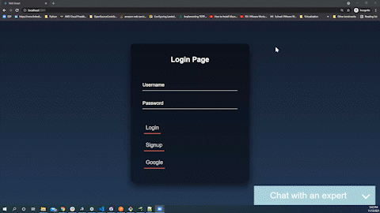

# Lambda Function
- [Here](LambdaFunction) is the lambda function which will be mapped to WallStreet Bot

# Demo


# Steps to run lambda function locally
- Create virtual env
- ```
    $ pip install python-lambda-local
    $ python-lambda-local -f lambda_handler .\lambda_function.py .\event.json    
    ```

# Steps to run function on aws
- Python 3.8
- Create zip folder which includes all files present [here](LambdaFunction)
- Request module is not present in lambda python runtime 3.8. 
    Steps to resolve error
    - ``` 
        pip install requests -t python-dependencies
         ```
    - Create zip folder of python-dependencies and upload it as a layer     


# Refernces
- https://github.com/HDE/python-lambda-local
- https://medium.com/@itsHabib/integrate-an-amazon-lex-chatbot-into-a-react-native-app-1536883ccbed
- https://docs.aws.amazon.com/lex/latest/dg/gs-cli.html
